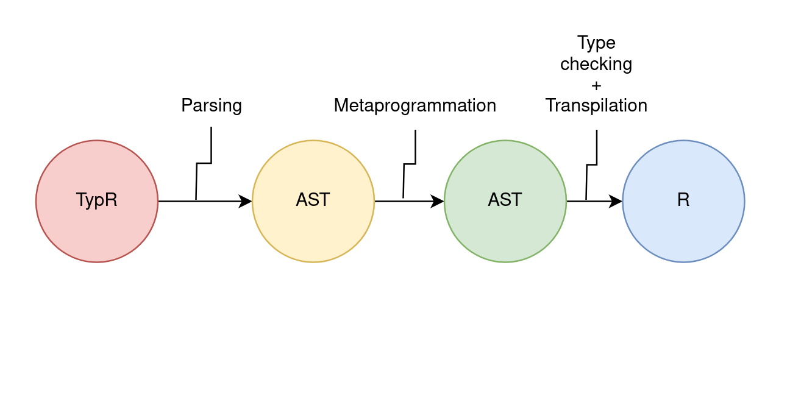

# Typr

A superset of the legendary R !

The project is still a prototype in progress and is really buggy. The syntax and the wanted features are there so there won't be some big change but additional features.


There is also a more mature project named vapour written in go who has some cool features: https://vapour.run/

## Installation

To install TypR, you will need to install `Rust` and `Prolog` (of course you should have R installed in your system):

- R's installation page: https://www.r-project.org/
- Rust's installation page: https://www.rust-lang.org/
- Prolog's installation page: https://www.swi-prolog.org/download/stable

You should be sure those tools are installed and accessible through the terminal.

### Installation

After that, you just need to install the executable:

```bash
cargo install typr
```

And you're good to go.

## Usage

Actually, the executable of TypR can only type-check the targeted file. The preferred file extension is `.ty`. For instance, if you want to execute the `app.ty` file you just need this command:

```bash
typr app.ty
```

## Documentation (minimal)

- First presentation video in French (subtitles in English): https://www.youtube.com/watch?v=5fWRaAPeJBs  
- Second presentation video in French (subtitle in English): https://www.youtube.com/watch?v=vUf31KiV3J4

### Philosophy: flexibility and type safety

#### What is TypR 

TypR is a word game with Typescript (a superset of JavaScript) and the common way of naming things in the R community. The initial goal is to create a better experience with building Packages for R (I want them to be easily compatible with the CRAN's requirements to be easy to ship). Indeed, TypR *is not only a type checker* but bring greater tools to build packages for data science in general and want to be an easy way to convert research paper into code. TypR add great static types and a flexible syntax with some cool tricks (metaprogramming) that make it great to work with.

#### What TypR is not

Although R looks like the next cool kid in the area with syntax greatly inspired by R and Rust, and many interesting features from Go, Nim, Roc. It doesn't try to replace them at all but tend to help the package builder and manager to reach their goals. 

TypR is not fundamentally OOP. Like R who is more a functional programming language, TypR follow this path for good reasons. Firstly, because the realm of data science is flooded with programming languages that are more on the Object-oriented programming side who has his own strength but his own weaknesses. Especially because it has his own limits in element representation (uniquely done with OOP) and strange design patterns. Functional programming offers a bit higher-level representation with less headache and the power of creating easy pipelines and parallelizable code.

### Transpilation process

To explain TypR in another way, it's a core calculus with quite a bit of syntax, sugar.



The transpilation process must pass by a first parsing stage then a modification of the abstract syntax tree to obtain through the process of metaprogramming. This is a fancy word for syntax, sugar. It's a way to transform a language and take some shortcuts to make it easier to work with. 

### First code

Let's build our first example! You can create a file named `app.ty` (or the name you want). TypR has a generalized syntax for building types. To create a numeric, you just have to write:

```scala
let a: num <- 5.0;

a
```

You can now run it with this command:

```bash
typr app.ty
```

You will get this result:

```
Type checking: 
num

Execution: 
[1] 5
```

As you can see, typR display two things. The first is the result of the type checking. TypR know that you defined a numeric so the expression `a` evaluate to the type `num` (=numeric).

The second thing displayed is the evaluation of the value of the variable `a`. Since we created it with the value, `5` it takes it as it is.

The `typr` binary created two files to do this task. They exist in the current directory and are respectively named `adt.pl` and `app.R`. `adt.pl` is the file (prolog file) containing the information about the code and the related types. TypR is able to reason about types with it and gives us the type checking we previously saw. The `app.R` is the file with the type annotation removed (but TypR don't only do that):

```R
# [other prebuild stuffs to work with typR]
# ...

n <- 5
n
```

You don't need to pay attention to the first lines of the document but to the last two lines. As you see, it's almost the same thing as the `app.ty` document with the exception of some element removed (the "let", and the type annotation). Of course TypR is not just R with types but it brings other great constructs from metaprogramming that will also bring a simpler syntax in TypR. It will build some code for you on the R's side. You can play with it and see it for yourself.

### Types

Even though TypR try to be the closest possible to the type system of R, it also takes its own route for certain things and do the translation of R. For now, not all basic R data types are represented but TypR has its own representation.

*Basic types:*

Each basic type gives a vector of size 1 in R. Boleans are now the two lower-case values `true` and `false` instead of the uppercase one (TRUE, FALSE or T, F).

| name       | TypR  | R       |
|------------|-------|---------|
| Integers   | int   | integer |
| Numerics   | num   | numeric |
| Characters | chars | bool    |
| Booleans   | bool  | logical |

```scala
let a: int = 5;
let b: num = 5.0; 
let c: chars = "5";
let d: bool = true;
```

Structural types:

| name                  | TypR                       | R               |
|-----------------------|----------------------------|-----------------|
| Arrays                | ([[index], [type]])        | vector + arrays |
| Records               | ({[[name]: [type]]*})      | lists           |
| Tuples (like records) | ([type]*)                  | lists           |
| Functions             | (([type]*) -> type)        | functions       |
| Tags                  | [name]\(type)              | NA, NaN, lists? |
| Unions (of Tags)      | type [\| type]+            | -               |
| Interfaces            | interface {a bit too much} | -               |

#### Arrays

One can build an array from any types. Array keep the information about the array size and its type. As any other types, you don't need to mention the type annotation. TypR can infer it for you.

*Difference with R*
TypR's array can only hold one type. It means, all the members of the array must have the same type.

*Examples*

```scala
let a: [3, bool] = [true, false, true];
let b = [true, false, true];
```

Here `a` and `b` have both the type `[3, bool]` with and without the type inference. 

We can also define multidimensional arrays in that way:

```scala
[[1, 2], [3, 4]]
```

This code will give you this result:

```
Type checking: 
[2, [2, int]]

Execution: 
     [,1] [,2]
[1,]    1    3
[2,]    2    4
```

The array type from TypR is recursive by definition. This means an array `[I, T]` is the combination of an index `I` and a type `T`, so `T` can be any type including another array type `[J, T]` so we can end with an array `[I, [J, T]]`. Since R doesn't support this feature, TypR is smart enough to transform it to a classical Array type in R.

You can also add as much layer as you want (but not really sure if it's that readable). You can create a tensor of dimension 3 (an array of arrays of arrays) in this fashion:

```scala
[[[1, 2], [3, 4]], [[5, 6], [7, 8]]]
```

I will let you see the result by yourself. But be sure to respect the dimensionality or else it will not work.

*Sequences*

Like R, TypR let you define sequence of elements. For instance:

```scala
1:4
```

Will give you this result:

```
Type checking: 
[4, int]

Execution: 
[1] 1 2 3 4
```

TypR also add the feature of defining steps:

```scala
0:2:20
```

Just mean "start from zero by step of two until we reach 20". It will give this result:

```
Type checking: 
[11, int]

Execution: 
[1]  0  2  4  6  8 10 12 14 16 18 20
```

TypR offer capabilities to act on array indexing and build functions that define the shape an array should have. It's a powerful tool let typR infer and check the shape of a multidimensional array like a matrix. For instance, sequences generated are just converted to the `seq` function in R. TypR has this definition for it:

```scala
pub let seq <- fn(a: #I, b: #J, c: #K): [#J-#I/#K+1, int] {
	...
};
```

At this stage, you don’t need to understand everything. This is just a function that takes 3 parameters (#I for the start number, #J for the end number and #K for the step) The resulting index is a calculation (#J-#I/#K+1) that TypR can use to guess the shape of the resulting array. This type of generics are `index generics`, those are like super ints who have the power to be used in arrays' index. It gives the power to define the resulting shape of complex operations like transpose or the dot product. A tutorial on this topic will come soon (since it can be a whole chapter by itself).

#### Records

A record is a structure that holds different types of data. It's the equivalent of a named list in R. It also has his owns capability like the row polymorphism.

*Difference with R*  
TypR records are a subtype of R lists. You can't build a record with unlabeled values like in R. This restriction prevent unsafe and unpredictable operations from occurring.

*Exemples*
To build a simple record representing a person with their name and age, you can just write:

```scala
:{name: "John", age: 19}
```

Will generate:

```
Type checking: 
{name: chars, age: int}

Execution: 
$name
[1] "John"

$age
[1] 19
```

To make a distinction with a scope and avoid long names like "list" or "record" for each object creation, We thought this notation will be easier to work with.

To access a member by its label, you just have to call it in this fashion:

```scala
let person = :{name: "John", age: 19};

person.name
```

Here, we accessed the name of the person. Records are mainly there to keep together a set of data in a logical way

#### Tuples

R tuples are a specific case of records. Indeed, they are just records who automatically generate numbered labels. Here:

```scala
("John", 19)
```

Will generate:

```
Type checking: 
{0: chars, 1: int}

Execution: 
[[1]]
[1] "John"

[[2]]
[1] 19
```

It's a faster and easier way to generate data on the fly.

#### Functions

Since TypR is more oriented toward a functional style, functions are values and have a type by themself. They are then anonymous by default and should be set in variables.

*Difference with R*
There aren't that much difference with R except function are created with the `fn` keyword instead of the `function` one. Also `return` is not a function anymore but a keyword.

You can define a function with a type annotation but it's better to focus only on the function signature and let TypR infer the rest.

```scala
let f <- fn(a: int, b: int): bool {
	a == b
};
```

TypR functions are the most complex elements of TypR since many actions (metaprogramming + type checking) must be done in the calling. But a lot of sugar has been added so everyone can use them seamlessly.

#### Tags

Tags are one of the algebraic data types (no need to know what an algebraic data type is yet) I needed the most but didn't know. I was asking myself which kind of union type of union I should use (general union or tagged union), but those are the elements that bring in the same type the security and the flexibility wanted for this language.

*Difference with R*

R doesn't have such a construct since, tags, unions and even interface are an abstract concept to put some clarity and restriction to what the code should do. But compared to the others, tags are a kind of value and should exist in real R code. I have not made the implementation of the translation to R yet, but I think I will make.

Tags are values that one can use on the fly. Each flag is unique and has its own type. It's useful do define some elements like:

```scala
let none: :None = None;
let nan: :NaN = NaN;
le na: :NA = NA;
```

If the tag is named `[tag_name]`, then its base type is `:[tag_name]`. They are R's factors on steroids and even Rust's enums on steroids. You can use them to define some collections (like the Day of the week, gender, etc.).

Tags can also handle one type with them:

```scala
let results: :Val(num) = Val(7.3);
let person: :Person({name: chars, age: int}) = Person(:{name: "Marc", age: 37});
```

Okay but what is their power ? Well, they can be unified together inside a union type ! But here we will see how useful it is for the return type in a if close:

```scala
if (true) {
	7
} else {
	"seven"
}
```

Here, TypR won’t accept this code since `7` (`int`) and `"seven"` (`chars`) aren't the same type. But if we use tags:

```scala
if (true) {
	Value(7)
} else {
	String("seven")
}
```

The return type will be `Value(int) | String(chars)` meaning TypR will automatically unify the results if they are tags. Tags must be "unwrapped" to access the values within, forcing a user to handle the different cases.

#### Union

Union is an abstract concept that won't really appear in the resulting R code. In summary, you can only unify tags. You can now regroup tags to create other types. For instance, to create an option type, one can create an alias into this union of values:

*Difference with R*
There is no concept of union in R so nothing to compare.

```R
type Option<T> = :Some(T) | :None;
```

And if my function can return a `Na` and a `NaN` instead of an int value, you can define your own type:

```R
type Failable<T> = :Value(T) | :NaN | :Na | :None;
```

This method is more flexible than an enum like Rust and more secure than an union from TypeScript.

#### Interfaces [still buggy]

TypR interfaces works like Go's interfaces. It's a typed way of doing duck typing: If it walks like a duck and quacks like a duck, then it's a duck. So there is no implicit implementation of an existing interface.

*Difference with R*
There is no concept of union in R so nothing to compare.

You can define an interface in this fashion:

```scala
type Addable = interface {
	add: fn(a: Self, b: Self): Self,
}
```

You can then define a function that takes any addable type in this way:

```scala
let time3 <- fn(n: Addable) {
	add(n, add(n, n))
};
```

The type int already had the function adds that respect the interface `Addable`, so it will be immediately accepter to pass an int in this function in different ways:

```scala
time3(5)
(5).time3()
5 |> time3()
```

### Main functionalities

- Uniform function call
- Operator overloading
- Generics + Index Generics
- Type embedding
- Interface inference
- Row polymorphism

#### Uniform function call

UFC (uniform function call) is one of my favorite features in programming languages. I love the simplicity of methods, but I am not a fan of classes anymore since they are less expressive than algebraic data types in general. But working with my functions using types and module and pipes isn't totally complete without methods call. So UFC bring the best of both worlds to me. I have also added some other forms of the original.

For instance, we can see the definition of the add function for integer types:

```scala
let incr <- fn(a: int): int {
	...
};
```

Now we can call it in different ways that give the same results:

```scala
incr(2)
(2).incr()
2 |> incr()
```

There are special elements `..` or `|>>` that make a function operate on an array level.

```scala
[1, 2, 3]..incr()
[1, 2, 3] |>> incr()
```

This code will add 3 to each element.

#### Operator overloading

Operator overloading is one of my favorite elements to build operations on types. It's a shortcut and a syntax sugar that let the user define operations for their custom types.

Imagine we create a type named point:

```scala
type Point = {x: int, y: int};

let p1 = :{x: 2, y: 1};
```

You can define a function `add` to add two points. Let's assume you just add each coordinate.

```scala
let add <- fn(p1: Point, p2: Point): Point {
	...	
};
```

You can obviously use the function in different ways:

```scala
add(p1, p1)
p1.add(p1)
p1 |> add(p1)
```

But you can also add a point in this fashion:

```scala
p1 + p1
```

Why is it possible ? Because `add` is a reserved symbol related to the binary operation `+`. So each time TypR see a `a+b`, it transform it to `add(a, b)`.

There are a group of reserved operators that change to their function's form.

| operator | function name |
|----------|---------------|
| +        | add           |
| ++       | add2          |
| -        | minus         |
| --       | minus2        |
| *        | mul           |
| **       | mul2          |
| /        | div           |
| //       | div2          |
| @        | at            |
| @@       | at2           |

You don't have to worry about the usage of if an operator is related to another type. Each type can use each symbol once.

#### Generics + Index Generics

Generics is one of the hardest concepts in this language, especially when we talk about Index Generics.

In complex terms, generics is a way to create functions that allow functions to work with more types related to specific relationship with parameters (parametric polymorphism).

Since it allows almost any type, it's better to use them for structural and general purpose. For instance, it's great to describe data structures that can work with many types (like array, graphs, tree, etc.). It's also great to use it to shape function composition.

Index Generics take the 

- Generics + Index Generics
- Type embedding
- Interface inference
- Row polymorphism

### Functional programming with TypR

### Object-oriented programming with TypR

