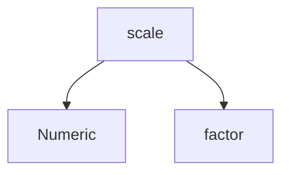

# 📘 **RFC‑SPG‑VIGNETTES‑0001 — Vignettes écrites à la main + fragments SPG injectés automatiquement**  
### *Système de templates R Markdown enrichis par le Semantic Project Graph (SPG)*

---

# 🎯 1. Objectif

Ce mode permet de créer des **vignettes R Markdown** (dans `vignettes/`) qui combinent :

- narration humaine (texte libre, explications, tutoriels)  
- **fragments techniques générés automatiquement** depuis le SPG  
- exécution optionnelle via knitr  

Le but est de garantir que **toutes les parties techniques** (signatures, exemples, schémas, relations, champs de types) restent **synchronisées** avec le code TypR, sans sacrifier la liberté narrative.

---

# 🧱 2. Architecture générale

```
vignettes/
 ├─ intro.Rmd
 ├─ types.Rmd
 ├─ api.Rmd
 └─ templates/
      └─ fragments/   (générés automatiquement)
```

Pipeline :

```
typr doc
 ├─ compile SPG
 ├─ generate fragments (JSON / Markdown)
 ├─ load Rmd templates
 ├─ replace placeholders with fragments
 ├─ write final Rmd files
 └─ (optionnel) knit to HTML/PDF
```

---

# 🧩 3. Placeholders SPG dans les vignettes

Les vignettes contiennent des **placeholders déclaratifs** :

```
{{ signature:scale }}
{{ examples:scale }}
{{ description:Circle }}
{{ fields:Circle }}
{{ graph:scale }}
```

Chaque placeholder correspond à un **fragment SPG**.

---

# 🧬 4. Spécification des placeholders

Chaque placeholder suit la forme :

```
{{ <fragment-type>:<entity-name> }}
```

## Types de fragments supportés

### 1. **signature**  
Transforme la signature TypR → usage R.

```
{{ signature:scale }}
```

Produit :

```
scale(x, factor)
```

---

### 2. **examples**  
Injecte les exemples SPG dans un chunk R.

```
```{r}
{{ examples:scale }}
```
```

Produit :

```r
scale(10, 2)
```

---

### 3. **description**  
Injecte la description SPG.

```
{{ description:Circle }}
```

Produit :

```
A geometric circle with radius r.
```

---

### 4. **fields**  
Liste les champs d’un type.

```
{{ fields:Circle }}
```

Produit :

```
- r: Numeric — radius of the circle
- center: Point — center of the circle
```

---

### 5. **graph**  
Génère un graphe mermaid/graphviz des relations SPG.

```
{{ graph:scale }}
```

Produit :



---

# 🏗️ 5. Format interne des fragments SPG

Les fragments sont générés dans :

```
.vignettes/spg_fragments/<entity>/<fragment>.md
```

Exemple :

```
.vignettes/spg_fragments/scale/signature.md
.vignettes/spg_fragments/scale/examples.md
.vignettes/spg_fragments/Circle/fields.md
```

Chaque fichier contient **du Markdown pur**, prêt à être injecté.

---

# 🔧 6. Mécanisme d’injection

Le moteur `typr doc` :

1. Charge le fichier `.Rmd`
2. Cherche les occurrences `{{ ... }}`
3. Résout le fragment correspondant dans `.vignettes/spg_fragments/`
4. Remplace inline
5. Écrit le fichier final dans `vignettes/compiled/`

---

# 🧪 7. Exemple complet de vignette avant/after

## **Avant (template)**

````markdown
# Introduction à TypR

TypR permet de créer des types structurés.

## Type Circle

{{ description:Circle }}

### Champs

{{ fields:Circle }}

### Exemple

```{r}
{{ examples:make_circle }}
```
````

---

## **Après (injecté)**

````markdown
# Introduction à TypR

TypR permet de créer des types structurés.

## Type Circle

A geometric circle with radius r.

### Champs

- r: Numeric — radius of the circle
- center: Point — center of the circle

### Exemple

```r
make_circle(10)
```
````

---

# 🧠 8. Pourquoi ce mode est optimal

- **narration 100% humaine**  
- **fragments 100% synchronisés** avec le code  
- compatible avec knitr, pkgdown, CRAN  
- fonctionne même si le code change  
- permet de générer plusieurs formats (HTML, PDF, site web)

---

# 🏆 9. Résumé de la spécification

| Élément | Description |
|--------|-------------|
| Placeholders | `{{ type:entity }}` |
| Types supportés | signature, examples, description, fields, graph |
| Source | SPG compilé |
| Sortie | Rmd enrichi |
| Pipeline | SPG → fragments → injection → Rmd final |
| Avantage | Narration + cohérence technique |

